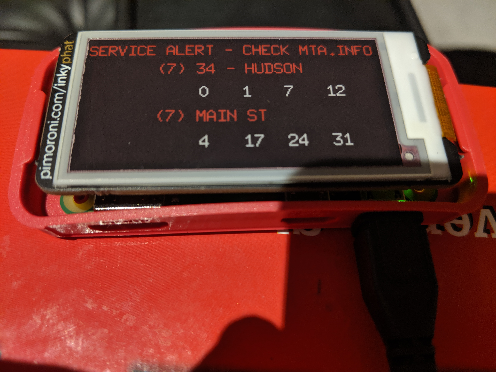

# Subwayclock

Subwayclock is a simple program used to power a Raspberry PI-based countdown
clock. The display is similar to the countdown clocks that can be seen on the
New York Subway platform.

# Requirements

In order to use this library, you'll need the following:

1. An MTA API key. You can register for an account at: http://datamine.mta.info/
2. A Raspberry PI. I have personally tested this on a Raspberry PI Zero W, but other models should work.
3. An [Inky pHAT](https://shop.pimoroni.com/products/inky-phat) display.

# Usage

1. Clone this repo. `git clone git@github.com:ztstewart/subwayclock.git`.
2. Modify `main.go` to use the correct stop ID for your home station and change the labels for your train line.
3. Add your MTA API Key in the `client.NewNYCTA(&client.Config{....})` line.
4. Compile the tool: `go build`. You can compile for the Raspberry Pi a more powerful machine: `GOOS=linux GOARCH=arm GOARM=5 go build`
5. (Optional) If you cross compiled (that is, compiled on another machine), copy the binary to your Raspberry Pi.
6. Run the binary: `./subwayclock`. It will continuosly update its information every minute by default.

# Running on boot

For convenience, there is a `subwayclock.service` file included in this repo. It is a [systemd](https://www.freedesktop.org/wiki/Software/systemd/) compatible service configuration file that you can use to stop and start this tool in compatible Linux distributions, such as Raspbian.

This is useful if this is the main use for your Raspberry Pi.

1. Edit subwayclock.service to point to the user and the location of the `subwayclock` executable on your Raspberry Pi.
2. Copy the file to the `/etc/systemd/system` directory: `sudo cp subwayclock.service /etc/systemd/system/subwayclock.service`
3. Start the service: `sudo systemctl start subwayclock`. This will make it start drawing to your e-ink screen.
4. Enable the service, which will start it on boot: `sudo systemctl enable subwayclock`.

You can disable the `subwayclock` service by running `sudo systemctl disable subwayclock`. This will prevent it from running on boot. To stop it temporarily, run `sudo systemctl stop subwayclock`
